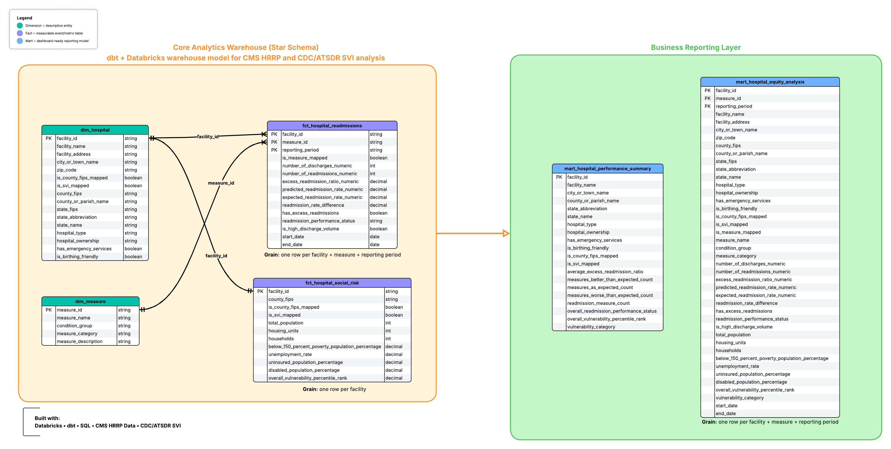
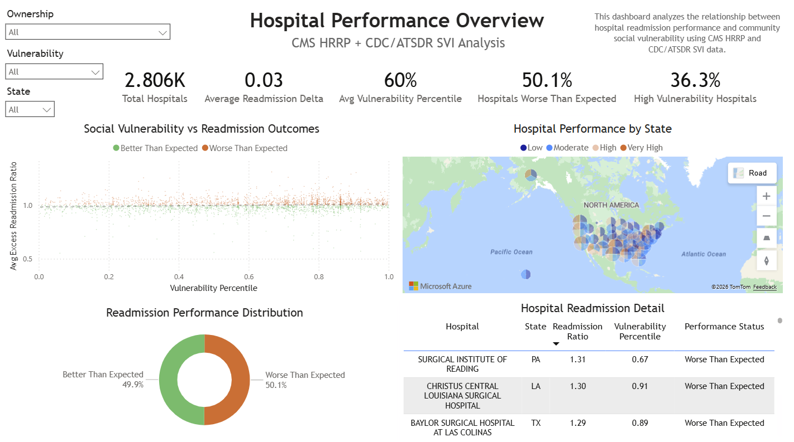
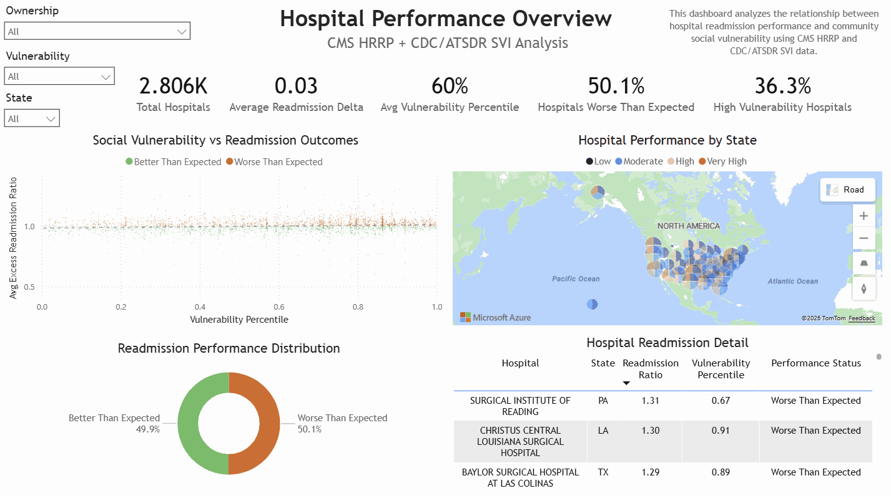
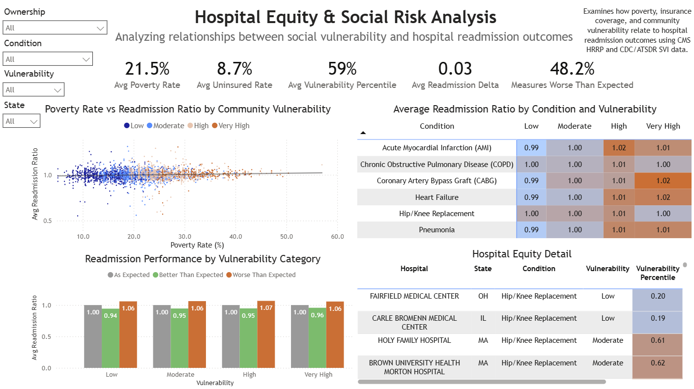
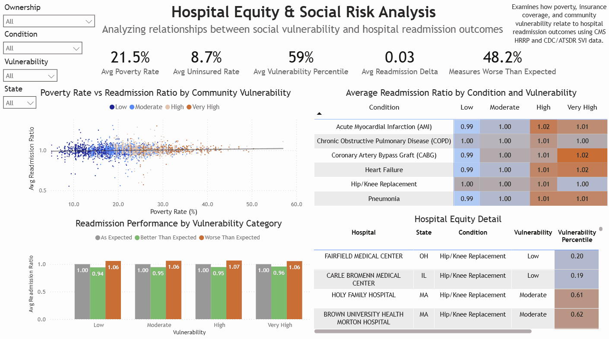
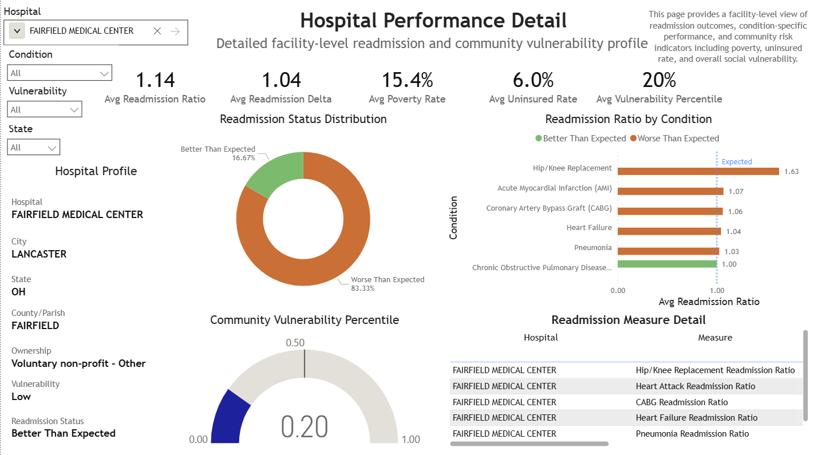
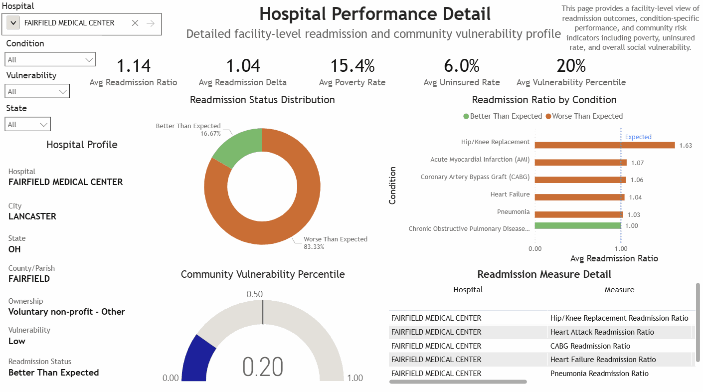

# Hospital Readmissions & Social Vulnerability Analytics

## Project Overview

This project analyzes hospital readmission performance alongside county-level social vulnerability indicators using public CMS HRRP, CMS Hospital General Information, CDC/ATSDR SVI, and FIPS reference data.

The goal is to explore how community-level social vulnerability indicators relate to hospital readmission outcomes and to identify patterns across hospitals, conditions, and geographic regions. 

### Business Questions

- How do poverty, insurance coverage, and community vulnerability relate to readmission performance?
- Which hospitals consistently perform better or worse than expected?
- Which conditions exhibit the greatest variation in readmission outcomes?
- Do hospitals in more socially vulnerable communities show different readmission patterns?

---

## Data Warehouse Architecture




The model separates the core analytical warehouse from dashboard-ready reporting models.

The core warehouse follows a star schema pattern with:

- `dim_hospital`
- `dim_measure`
- `fct_hospital_readmissions`
- `fct_hospital_social_risk`

Dashboard-ready marts include:

- `mart_hospital_performance_summary`
- `mart_hospital_equity_analysis`

---

## Transformation Pipeline

Raw public datasets were loaded into Databricks and transformed using dbt:

`raw → staging → intermediate → marts`

### Raw Layer

Source-aligned tables loaded into Databricks with minimal transformation.

### Staging Layer

Staging models clean and standardize individual sources. This includes:

- Renaming columns into analytics-friendly names
- Casting data types
- Standardizing boolean values
- Creating normalized county join keys
- Preserving raw and numeric versions of CMS fields where appropriate
- Preparing FIPS and readmission measure reference data for joins

### Intermediate Layer

Intermediate models apply reusable business logic and joins, including:

- Enriching hospitals with FIPS geography
- Joining hospitals to county-level SVI data
- Mapping HRRP measure IDs to readable condition names
- Calculating readmission performance indicators
- Creating reusable hospital-level and measure-level analytical datasets

### Marts Layer

Marts provide dashboard-ready tables for Power BI, including:

- A hospital-level performance summary
- A wide equity analysis model combining hospital, readmission, geographic, and SVI context

---

## Key Analytical Notes

All CMS HRRP records in this dataset cover the reporting period **July 1, 2021 through June 30, 2024**. Results should therefore be interpreted as a **cross-sectional analytical snapshot** rather than a longitudinal trend analysis.

A threshold of **500 discharges** was selected as a simple analytical segmentation variable and does **not** represent an official CMS classification.

This project uses static public datasets. It is intended for analytical modeling, dashboarding, and portfolio demonstration rather than operational healthcare decision-making.

Results should be interpreted as exploratory analytics rather than causal conclusions.

The analysis uses public aggregate datasets and does not include patient-level data.

---

## Dashboard Exposures

The three Power BI dashboards are documented in dbt as exposures, linking dashboard assets back to the marts that support them:

- Hospital Performance Overview
- Hospital Equity & Social Risk Analysis
- Hospital Performance Detail

> **Dashboard availability:** The Power BI report was developed locally using static, public datasets. Because this project was completed without an organizational Power BI/Fabric workspace, the dashboards are presented through screenshots and GIF walkthroughs rather than a live hosted report.


---

## Dashboards & Insights

### Hospital Performance Overview


### Interactive Demonstration


The overview dashboard summarizes national hospital readmission performance, including:

- Total hospitals analyzed
- Average readmission gap
- Average social vulnerability percentile
- Percentage of hospitals worse than expected
- Percentage of hospitals in high-vulnerability communities

It also includes geographic and facility-level views to identify hospitals with elevated readmission ratios.

Key finding(s):
- Approximately half of hospitals performed worse than expected, suggesting that readmission challenges remain widespread across the dataset.
- Community vulnerability and readmission outcomes display only a modest relationship.
- Performance variation exists across states and hospital ownership types.

---

### Hospital Equity & Social Risk Analysis


### Interactive Demonstration


The equity dashboard explores relationships between hospital readmission outcomes and community-level social risk indicators, including:

- Poverty rate
- Uninsured rate
- Overall social vulnerability percentile
- Readmission ratio by condition and vulnerability category

This dashboard helps identify whether hospitals serving more vulnerable communities show different readmission patterns.

Key finding(s):
- Higher poverty and vulnerability levels appear to coincide with modest increases in readmission ratios in the dashboard views.
- Certain clinical conditions exhibit stronger vulnerability-related performance differences than others.

---

### Hospital Performance Detail



### Interactive Demonstration


The detail dashboard provides a facility-level view of:

- Readmission performance
- Condition-specific readmission ratios
- Community vulnerability percentile
- Poverty and uninsured rates
- Hospital profile attributes

This page supports drilldown-style analysis for individual hospitals.

Key finding(s):
- Readmission outcomes vary substantially by condition.

---

## Data Sources

- Centers for Medicare & Medicaid Services (CMS). (2026, January 26). *Hospital Readmissions Reduction Program*. Provider Data Catalog. Retrieved May 11, 2026, from https://data.cms.gov/provider-data/dataset/9n3s-kdb3

- Centers for Medicare & Medicaid Services (CMS). (2026, April 28). *Hospital General Information*. Provider Data Catalog. Retrieved May 11, 2026, from https://data.cms.gov/provider-data/dataset/xubh-q36u

- Centers for Disease Control and Prevention / Agency for Toxic Substances and Disease Registry / Geospatial Research, Analysis, and Services Program. (2022). *CDC/ATSDR Social Vulnerability Index 2022 Database U.S.* Retrieved May 11, 2026, from https://www.atsdr.cdc.gov/placeandhealth/svi/data_documentation_download.html

- U.S. Department of Transportation. *State, County, and City FIPS Reference Table*. data.transportation.gov. Retrieved May 11, 2026, from https://data.transportation.gov/Railroads/State-County-and-City-FIPS-Reference-Table/eek5-pv8d/about_data

---

## Technology Stack

- **Databricks** for data storage, SQL development, and Delta table management
- **dbt** for data transformation, testing, documentation, and model organization
- **Power BI** for dashboard development
- **GitHub** for version control and project documentation

---

## dbt Project Structure

```text
models/
  staging/
    atsdr/
    cms/
    reference/
  intermediate/
  marts/

seeds/
  fips_lookup.csv
  county_name_overrides.csv
  readmission_measures.csv

macros/
  generate_schema_name.sql
  normalize_county_name.sql
  parse_numeric_or_null.sql
  standardize_boolean.sql
```

---

## Important Macros

| Macro                   | Purpose                                                                                                                                          |
| ----------------------- | ------------------------------------------------------------------------------------------------------------------------------------------------ |
| `generate_schema_name`  | Overrides dbt’s default schema naming so custom model schemas map directly to Databricks schemas such as `staging`, `intermediate`, and `marts`. |
| `normalize_county_name` | Creates standardized county join keys for geographic matching CMS hospital counties to FIPS reference data.                                      |
| `parse_numeric_or_null` | Converts CMS numeric text fields and `N/A` values into usable numeric columns.                                                                   |
| `standardize_boolean`   | Converts source yes/no-style values into consistent boolean fields.                                                                              |

---

## Data Quality and Testing

The dbt project includes tests for:

- Primary key uniqueness
- Required non-null fields
- Accepted categorical values
- Relationship integrity between fact and dimension models
- Composite uniqueness where model grain requires multiple fields

Examples include:

- `facility_id` uniqueness in `dim_hospital`
- `measure_id` uniqueness in `dim_measure`
- Relationship tests from fact tables to dimensions
- Composite uniqueness for readmission fact grain: facility, measure, and reporting period

---

## Model Grain

|Model|Grain|
|---|---|
|`dim_hospital`|One row per hospital|
|`dim_measure`|One row per readmission measure|
|`fct_hospital_readmissions`|One row per hospital, measure, and reporting period|
|`fct_hospital_social_risk`|One row per hospital|
|`mart_hospital_performance_summary`|One row per hospital|
|`mart_hospital_equity_analysis`|One row per hospital, measure, and reporting period|

---

## Repository Status

This project is complete as a portfolio analytics engineering project, with room for future enhancements such as:

- Additional reporting years for longitudinal analysis
- More granular geographic matching
- Geographic clustering analysis
- Additional CMS quality metrics
- Automated dashboard deployment
- Published Power BI Service dashboard links

---

## Author

Kayla Jones
